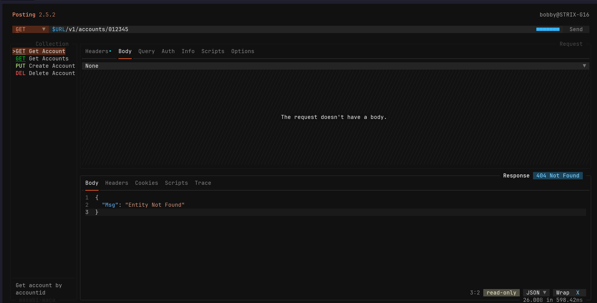

<h3 align="center">
 Posty for <a href="https://github.com/darrenburns/posting">Posting</a>
</h3>
 

 
 
 

 

## Usage

1. Download the theme file (posty.yaml).
2. Use `posting locate themes` to locate the themes directory.
3. Move the theme file to the themes directory.
4. Enter posting, use `<ctrl> + p` to bring up the command palette, select "Change theme" from the menu, then set the theme to your liking. Or you can set the theme as `posty` in your posting configuration file.

